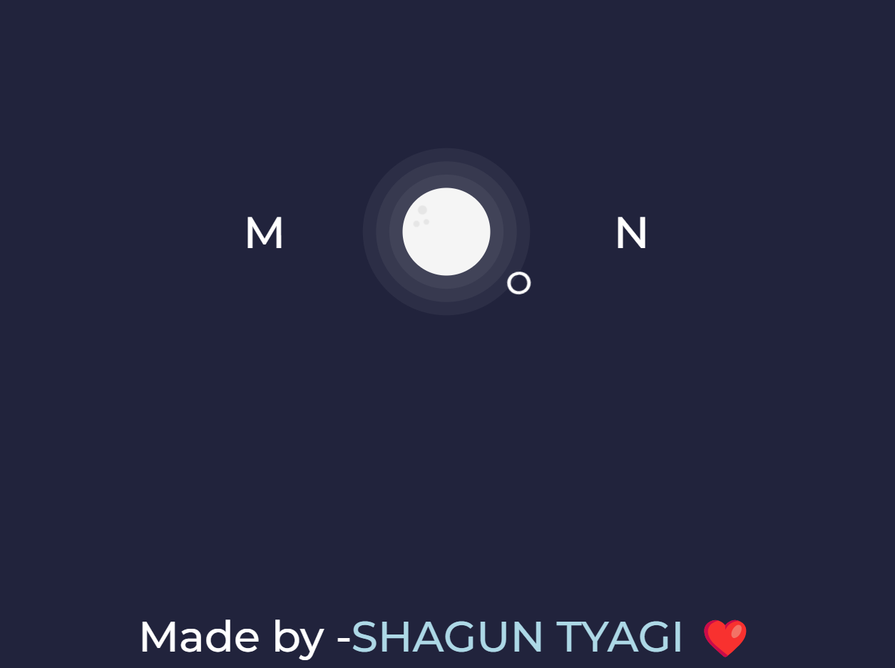

# Moon


This project showcases a simple yet visually appealing moon animation using HTML and CSS. The animation includes a rotating orbit and carefully styled moon elements.
## Demo

You can see a live demo of the moon animation on [GitHub Pages](#theshaguntyagi.github.io/Moon/).

## Features

- **Responsive Design:** The animation is designed to be responsive across various screen sizes.
- **CSS Animations:** Utilizes CSS keyframes to create a visually engaging moon orbit.
- **Google Font Integration:** The "Montserrat" Google Font is integrated for improved typography.
- **Carefully Styled Elements:** A cohesive color scheme and subtle styling details enhance the overall design.

## Getting Started

Follow these instructions to get a copy of the project up and running on your local machine.

### Prerequisites

There are no specific prerequisites for this project other than a modern web browser.

### Installation

1. Clone the repository:

   ```bash
   git clone https://github.com/your-username/moon-animation.git
Open the index.html file in your preferred web browser.

Explore and enjoy the moon animation!

###Usage

Feel free to use, modify, or extend this project. It's a great starting point for experimenting with HTML and CSS animations.

###Responsive Design

The project uses viewport units (vmin, vmax) and media queries to ensure responsiveness on a variety of devices. Elements dynamically adjust based on the viewport size.

###Dependencies
 
The project has no external dependencies other than the Google Font API, which is used for the "Montserrat" font. All styles and animations are achieved using HTML and CSS.

###Contributing

Contributions are welcome! Feel free to open issues, submit pull requests, or provide suggestions to improve the project.

Happy coding! 🚀


